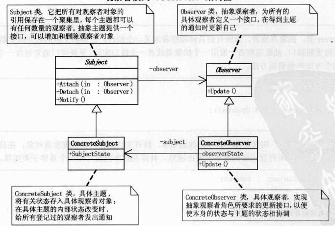
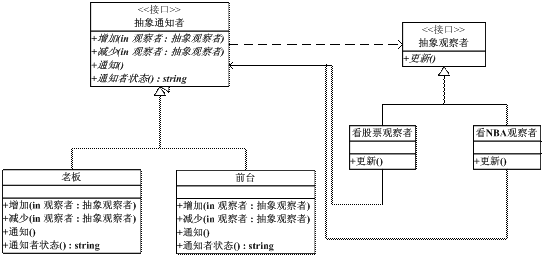

# 十、观察者模式

模式特点：定义了一种一对多的关系，让多个观察对象同时监听一个主题对象，当主题对象状态发生变化时会通知所有观察者。
程序实例：公司里有两种上班时趁老板不在时偷懒的员工：看NBA的和看股票行情的，并且事先让老板秘书当老板出现时通知他们继续做手头上的工作。
程序特点： tbs.go 实现事件机制，相当于C#委托机制

 
 


```
package main
 
import (
    "./tbs"
    "fmt"
)
 
type StockObserver struct {
    name string
    Subject
}
 
func (this *StockObserver) CloseStockMarket(event *tbs.Event) {
    fmt.Println(this.getState(), this.name, "关闭股票行情，继续工作！")
}
 
type NBAObserver struct {
    name string
    Subject
}
 
func (this *NBAObserver) CloseNBADirectSeeding(event *tbs.Event) {
    fmt.Println(this.getState(), this.name, "关闭NBA直播，继续工作！")
}
 
type Subject interface {
    Notify()
    setState(string)
    getState() string
}
 
type Secretary struct {
    dispatcher *tbs.Dispatcher
    action     string
}
 
func (this *Secretary) Notify() {
    //随便弄个事件携带的参数，我把参数定义为一个map
    params := make(map[string]interface{})
    params["id"] = 1001
    //创建一个事件对象
    event := tbs.CreateEvent("临时抽查", params)
    this.dispatcher.DispatchEvent(event)
}
 
func (this *Secretary) setState(value string) {
    this.action = value
}
 
func (this *Secretary) getState() string {
    return this.action
}
 
func NewSecretary() *Secretary {
    secretary := new(Secretary)
    secretary.dispatcher = tbs.SharedDispatcher()
    return secretary
}
 
type Boss struct {
    dispatcher *tbs.Dispatcher
    action     string
}
 
func NewBoss() *Boss {
    boss := new(Boss)
    boss.dispatcher = tbs.SharedDispatcher()
    return boss
}
 
func (this *Boss) Notify() {
    //随便弄个事件携带的参数，我把参数定义为一个map
    params := make(map[string]interface{})
    params["id"] = 1000
    //创建一个事件对象
    event := tbs.CreateEvent("临时抽查", params)
    this.dispatcher.DispatchEvent(event)
}
 
func (this *Boss) setState(value string) {
    this.action = value
}
 
func (this *Boss) getState() string {
    return this.action
}
 
func main() {
    done := make(chan bool, 1)
    go func() {
        huhansan := NewBoss()
        sec := NewSecretary()
        tongshi3 := &NBAObserver{"李劲松", sec}
        tongshi1 := &StockObserver{"魏关姹", huhansan}
        tongshi2 := &NBAObserver{"易管查", huhansan}
 
        var cb tbs.EventCallback = tongshi1.CloseStockMarket
        huhansan.dispatcher.AddEventListener("临时抽查", &cb)
 
        var cb2 tbs.EventCallback = tongshi2.CloseNBADirectSeeding
        huhansan.dispatcher.AddEventListener("临时抽查", &cb2)
 
        var cb3 tbs.EventCallback = tongshi3.CloseNBADirectSeeding
        sec.dispatcher.AddEventListener("临时抽查", &cb3)
 
        huhansan.setState("我胡汉三回来了！")
        sec.setState("我陈美嘉回来了！")
        sec.Notify()
        huhansan.Notify()
        huhansan.dispatcher.RemoveEventListener("临时抽查", &cb)
        huhansan.Notify()
        done <- true
    }()
    <-done
}


```

```
package tbs
 
import (
//"fmt"
)
 
type Dispatcher struct {
    listeners map[string]*EventChain
}
 
type EventChain struct {
    chs       []chan *Event
    callbacks []*EventCallback
}
 
func CreateEventChain() *EventChain {
    return &EventChain{chs: []chan *Event{}, callbacks: []*EventCallback{}}
}
 
type Event struct {
    eventName string
    Params    map[string]interface{}
}
 
func CreateEvent(eventName string, params map[string]interface{}) *Event {
    return &Event{eventName: eventName, Params: params}
}
 
type EventCallback func(*Event)
 
//var _instance *Dispatcher 单例模式
 
func SharedDispatcher() *Dispatcher {
    var _instance *Dispatcher
    if _instance == nil {
        _instance = &Dispatcher{}
        _instance.Init()
    }
    return _instance
}
 
func (this *Dispatcher) Init() {
    this.listeners = make(map[string]*EventChain)
}
 
func (this *Dispatcher) AddEventListener(eventName string, callback *EventCallback) {
    eventChain, ok := this.listeners[eventName]
    if !ok {
        eventChain = CreateEventChain()
        this.listeners[eventName] = eventChain
    }
 
    //exist := false
    for _, item := range eventChain.callbacks {
        if item == callback {
            //exist = true
            return
        }
    }
 
    //if exist {
    //  return
    //}
 
    ch := make(chan *Event)
 
    //fmt.Printf("add listener: %s\n", eventName)
    eventChain.chs = append(eventChain.chs[:], ch)
    eventChain.callbacks = append(eventChain.callbacks[:], callback)
 
    go func() {
        for {
            event := <-ch
            if event == nil {
                break
            }
            (*callback)(event)
        }
    }()
}
 
func (this *Dispatcher) RemoveEventListener(eventName string, callback *EventCallback) {
    eventChain, ok := this.listeners[eventName]
    if !ok {
        return
    }
 
    var ch chan *Event
    exist := false
    key := 0
    for k, item := range eventChain.callbacks {
        if item == callback {
            exist = true
            ch = eventChain.chs[k]
            key = k
            break
        }
    }
 
    if exist {
        //fmt.Printf("remove listener: %s\n", eventName)
        ch <- nil
 
        eventChain.chs = append(eventChain.chs[:key], eventChain.chs[key+1:]...)
        eventChain.callbacks = append(eventChain.callbacks[:key], eventChain.callbacks[key+1:]...)
    }
}
 
func (this *Dispatcher) DispatchEvent(event *Event) {
    eventChain, ok := this.listeners[event.eventName]
    if ok {
        //fmt.Printf("dispatch event: %s\n", event.eventName)
        for _, chEvent := range eventChain.chs {
            chEvent <- event
        }
    }
}

```


