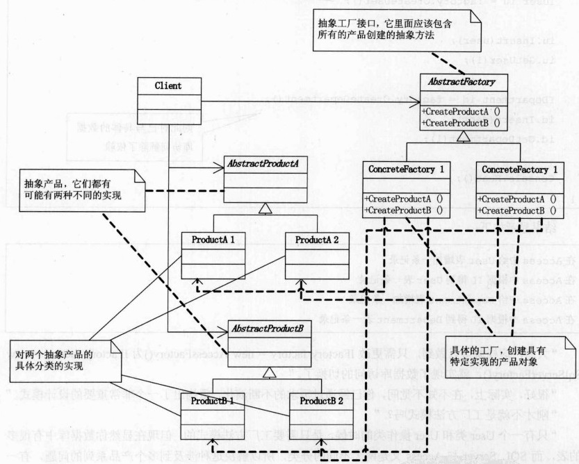
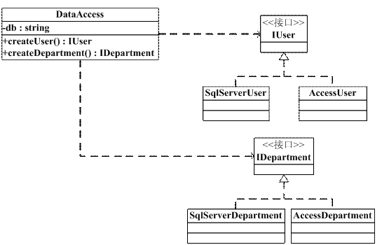

# 十一、抽象工厂模式

模式特点：提供一个创建一系列相关或相互依赖对象的接口，而无需指定它们的类。
程序实例：提供对不同的数据库访问的支持。
　　　　　IUser和IDepartment是两种不同的抽象产品，它们都有Access和SQL Server这两种不同的实现；IFactory是产生IUser和IDepartment的抽象工厂，根据具体实现（AccessFactory和SqlFactory）产生对应的具体的对象（CAccessUser与CAccessDepartment，或者CSqlUser与CSqlDepartment）。
遗留问题：
暂未找到golang 反射实现java 中的class.forName
 
    

  

```
package main
 
import (
    "fmt"
    //"reflect"
)
 
type User struct {
    id   int
    name string
}
 
func (this *User) getId() int {
    return this.id
}
 
func (this *User) SetId(id int) {
    this.id = id
}
 
func (this *User) getName() string {
    return this.name
}
 
func (this *User) setName(name string) {
    this.name = name
}
 
type IUser interface {
    insert(*User)
    getUser(int) *User
}
 
type SqlServerUser struct {
}
 
func (this *SqlServerUser) insert(user *User) {
    fmt.Println("在SQL Server中给User表增加一条记录")
}
 
func (this *SqlServerUser) getUser(id int) *User {
    fmt.Println("在SQL Server中根据ID得到User表一条记录")
    return nil
}
 
type AccessUser struct {
}
 
func (this *AccessUser) insert(user *User) {
    fmt.Println("在SQL Server中给User表增加一条记录")
}
 
func (this *AccessUser) getUser(id int) *User {
    fmt.Println("在SQL Server中根据ID得到User表一条记录")
    return nil
}
 
type IFactory interface {
    createUser() IUser
    createDepartment() IDepartment
}
 
type SqlServerFactory struct {
}
 
func (this *SqlServerFactory) createUser() IUser {
    return new(SqlServerUser)
}
 
func (this *SqlServerFactory) createDepartment() IDepartment {
    return new(SqlServerDepartment)
}
 
type AccessFactory struct {
}
 
func (this *AccessFactory) createUser() IUser {
    return new(AccessUser)
}
 
func (this *AccessFactory) createDepartment() IDepartment {
    return new(AccessDepartment)
}
 
type Department struct {
    id   int
    name string
}
 
func (this *Department) getId() int {
    return this.id
}
 
func (this *Department) SetId(id int) {
    this.id = id
}
 
func (this *Department) getName() string {
    return this.name
}
 
func (this *Department) setName(name string) {
    this.name = name
}
 
type IDepartment interface {
    insert(department *Department)
    getDepartment(id int) *Department
}
 
type SqlServerDepartment struct {
}
 
func (this *SqlServerDepartment) insert(department *Department) {
    fmt.Println("在SQL Server中给Deaprtment表增加一条记录")
}
 
func (this *SqlServerDepartment) getDepartment(id int) *Department {
    fmt.Println("在SQL Server中根据ID得到Deaprtment表一条记录")
    return nil
}
 
type AccessDepartment struct {
}
 
func (this *AccessDepartment) insert(department *Department) {
    fmt.Println("在SQL Server中给Deaprtment表增加一条记录")
}
 
func (this *AccessDepartment) getDepartment(id int) *Department {
    fmt.Println("在SQL Server中根据ID得到Deaprtment表一条记录")
    return nil
}
 
type DataAccess struct {
    db string
}
 
func (this *DataAccess) createUser() (iuser IUser) {
    if this.db == "Sqlserver" {
        iuser = new(SqlServerUser)
    } else if this.db == "Access" {
        iuser = new(AccessUser)
    }
    return
}
 
func (this *DataAccess) createDepartment() (id IDepartment) {
    if this.db == "Sqlserver" {
        id = new(SqlServerDepartment)
    } else if this.db == "Access" {
        id = new(AccessDepartment)
    }
    return
}
 
func main() {
    database := &DataAccess{"Sqlserver"}
    user := new(User)
    department := new(Department)
    iu := database.createUser()
    iu.insert(user)
    iu.getUser(1)
 
    id := database.createDepartment()
    id.insert(department)
    id.getDepartment(1)
}

```