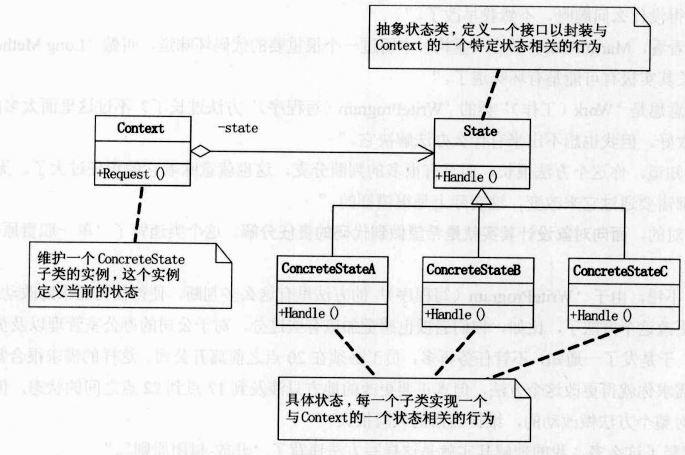
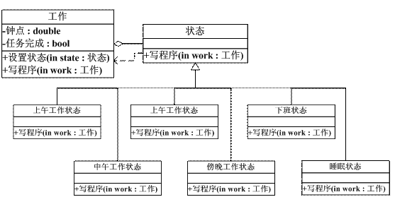

# 十二、状态模式

模式特点：当一个对象的内在状态改变时允许改变其行为，这个对象看起来像是改变了其类。
程序实例：描述一个程序员的工作状态，当需要改变状态时发生改变，不同状态下的方法实现不同
标签： <无>

 
 

```
package main
 
import (
    "fmt"
)
 
//State类，抽象状态类，定义一个抽象方法“写程序”
type State interface {
    writeProgram(Work)
}
 
//上午和中午工作状态类
type ForenoonState struct {
}
 
func (this *ForenoonState) writeProgram(work Work) {
    if work.getHour() < 12 {
        fmt.Println("当前时间：", work.getHour(), "点 上午工作，精神百倍")
    } else {
        work.setState(new(NoonState))
        work.writeProgram()
    }
}
 
//中午工作状态
type NoonState struct {
}
 
func (this *NoonState) writeProgram(work Work) {
    if work.getHour() < 13 {
        fmt.Println("当前时间：", work.getHour(), "点 饿了，午饭，犯困，午休")
    } else {
        work.setState(new(AfternoonState))
        work.writeProgram()
    }
}
 
//下午工作状态
type AfternoonState struct {
}
 
func (this *AfternoonState) writeProgram(work Work) {
    if work.getHour() < 17 {
        fmt.Println("当前时间：", work.getHour(), "点 下午状态还不错，继续努力")
    } else {
        work.setState(new(EveningState))
        work.writeProgram()
    }
}
 
//晚上工作状态
type EveningState struct {
}
 
func (this *EveningState) writeProgram(work Work) {
    if work.isFinish() {
        work.setState(new(RestState))
        work.writeProgram()
    } else {
        if work.getHour() < 21 {
            fmt.Println("当前时间：", work.getHour(), "点 加班啊，疲惫至极")
        } else {
            work.setState(new(SleepingState))
            work.writeProgram()
        }
    }
}
 
//睡眠状态
type SleepingState struct {
}
 
func (this *SleepingState) writeProgram(work Work) {
    fmt.Println("当前时间：", work.getHour(), "点 扛不住了，睡着了")
}
 
//下班休息状态
type RestState struct {
}
 
func (this *RestState) writeProgram(work Work) {
    fmt.Println("当前时间：", work.getHour(), "点 下班回家了")
}
 
//工作类，此时没有了过长的分支判断语句
type Work struct {
    hour   int
    finish bool
    state  State
}
 
func NewWork() *Work {
    state := new(ForenoonState)
    return &Work{state: state}
}
 
func (w *Work) writeProgram() {
    w.state.writeProgram(*w)
}
 
func (w *Work) getHour() int {
    return w.hour
}
 
func (w *Work) setHour(hour int) {
    w.hour = hour
}
 
func (w *Work) isFinish() bool {
    return w.finish
}
 
func (w *Work) setFinish(finish bool) {
    w.finish = finish
}
 
func (w *Work) getState() State {
    return w.state
}
 
func (w *Work) setState(state State) {
    w.state = state
}
 
//客户端代码，没有任何改动。但我们的程序却更加灵活易变了。
func main() {
    work := NewWork()
    work.setHour(9)
    work.writeProgram()
    work.setHour(10)
    work.writeProgram()
    work.setHour(12)
    work.writeProgram()
    work.setHour(13)
    work.writeProgram()
    work.setHour(14)
    work.writeProgram()
    work.setHour(17)
 
    work.setFinish(true)
    work.writeProgram()
    work.setHour(19)
    work.writeProgram()
    work.setHour(22)
    work.writeProgram()
}

```

