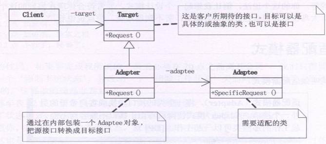

# 十三、适配器模式

模式特点：将一个类的接口转换成为客户希望的另外一个接口。
程序实例：用户通过适配器使用一个类的方法。

 
 

```
package main
 
import (
    "fmt"
)
 
func main() {
    var b Player = NewForwards("巴蒂尔")
    b.attack()
    var m Player = NewGuards("麦克格雷迪")
    m.attack()
    var ym Player = NewTranslator("姚明")
    ym.attack()
    ym.defense()
}
 
type RealPlayer struct {
    name string
}
 
type Player interface {
    attack()
    defense()
}
 
type Forwards struct {
    RealPlayer
}
 
func NewForwards(name string) *Forwards {
    return &Forwards{RealPlayer{name}}
}
 
func (forwards Forwards) attack() {
    fmt.Println("前锋", forwards.name, "进攻")
}
 
func (forwards Forwards) defense() {
    fmt.Println("前锋", "防守")
 
}
 
type Center struct {
    RealPlayer
}
 
func NewCenter(name string) *Center {
    return &Center{RealPlayer{name}}
}
 
func (center Center) attack() {
    fmt.Println("中锋", center.name, "进攻")
}
 
func (center Center) defense() {
    fmt.Println("中锋", center.name, "防守")
}
 
type Guards struct {
    RealPlayer
}
 
func NewGuards(name string) *Guards {
    return &Guards{RealPlayer{name}}
}
 
func (guards Guards) attack() {
    fmt.Println("后卫", guards.name, "进攻")
}
 
func (guards Guards) defense() {
    fmt.Println("后卫", guards.name, "防守")
}
 
type ForeignCenter struct {
    name string
}
 
func (foreignCenter ForeignCenter) attack() {
    fmt.Println("外籍中锋", foreignCenter.name, "进攻")
}
 
func (foreignCenter ForeignCenter) defense() {
    fmt.Println("外籍中锋", foreignCenter.name, "防守")
}
 
type Translator struct {
    RealPlayer
    ForeignCenter
}
 
/*func (translator Translator) attack() {
    translator.attack()
}
 
func (translator Translator) defense() {
    translator.defense()
}
*/
func NewTranslator(name string) *Translator {
    return &Translator{RealPlayer{name}, ForeignCenter{name}}
}

```