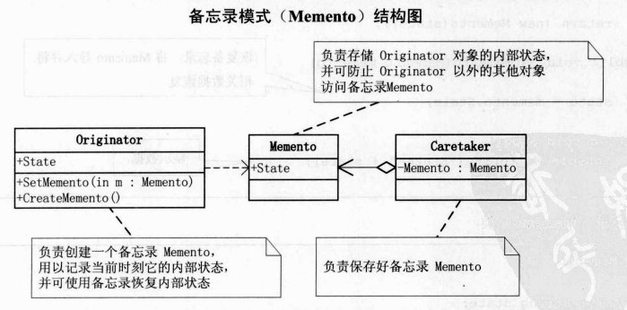

# 十四、备忘录模式

备忘录（Memento）：在不破坏封装性的前提下，捕获一个对象的状态的内部状态，并在该对象之外保存这个状态，这样以后就可以将该对象恢复到原先保存的状态
Originator（发起人）：负责创建一个备忘录Memento，用以记录当前时刻它的内部状态，并可使用备忘录恢复内部状态。Originator可根据需要决定Memento存储Originator的哪些内部状态
Memento（备忘录）：负责存储Originator对象的内部状态，并可防止Originator以外的其他对象访问备忘录Memento。备忘录有两个接口，Caretaker只能看见备忘录的窄借口，他只能将备忘录传递给其他对象。Originator能够看到一个宽接口，允许他访问返回到先前状态所需的所有数据
Caretaker（管理者）：负责保存好备忘录Memento，不能对备忘录的内容进行操作或检查

 
 

```
package main
 
import (
    "fmt"
)
 
type GameRole struct {
    vit int
    atk int
    def int
}
 
func (this *GameRole) StateDisplay() {
    fmt.Println("角色当前状态：")
    fmt.Println("体力：", this.vit)
    fmt.Println("攻击力：", this.atk)
    fmt.Println("防御：", this.def)
    fmt.Println("")
}
 
func (this *GameRole) GetInitState() {
    this.vit = 100
    this.def = 100
    this.atk = 100
}
 
func (this *GameRole) Fight() {
    this.vit = 0
    this.def = 0
    this.atk = 0
}
 
func (this *GameRole) SaveState() RoleStateMemento {
    return RoleStateMemento{this.vit, this.atk, this.def}
}
 
func (this *GameRole) RecoveryState(memento RoleStateMemento) {
    this.vit = memento.vit
    this.atk = memento.atk
    this.def = memento.def
}
 
type RoleStateMemento struct {
    vit int
    atk int
    def int
}
 
type RoleStateCaretaker struct {
    memento RoleStateMemento
}
 
func main() {
    lixiaoyao := new(GameRole)
    lixiaoyao.GetInitState()
    lixiaoyao.StateDisplay()
 
    stateAdmin := new(RoleStateCaretaker)
    stateAdmin.memento = lixiaoyao.SaveState()
 
    lixiaoyao.Fight()
    lixiaoyao.StateDisplay()
 
    lixiaoyao.RecoveryState(stateAdmin.memento)
    lixiaoyao.StateDisplay()
}

```