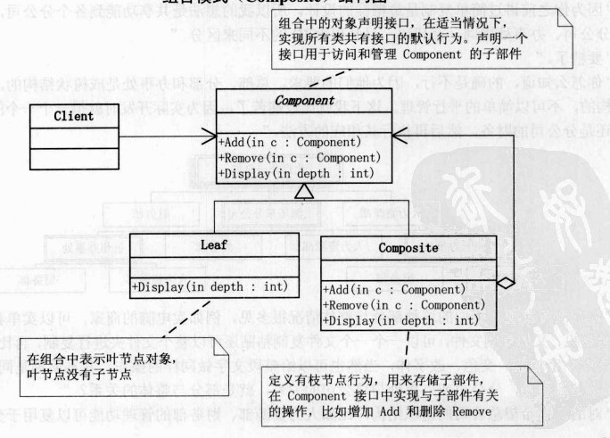
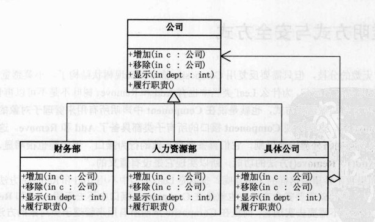

# 十五、组合模式

 组合模式（Composite），将对象组合成树形结构以表示‘部分-整体’的层次结构。
 组合模式使得用户对单个对象和组合对象的使用具有一致性
 
  
  
 
 ```
 package main
 
import (
    "fmt"
    "strings"
)
 
type Company interface {
    add(Company)
    remove(Company)
    display(int)
    lineOfDuty()
}
 
type RealCompany struct {
    name string
}
 
type ConcreateCompany struct {
    RealCompany
    list map[Company]Company
}
 
func NewConcreateCompany(name string) *ConcreateCompany {
    list := make(map[Company]Company)
    return &ConcreateCompany{RealCompany{name}, list}
}
 
func (this *ConcreateCompany) add(company Company) {
    this.list[company] = company
}
 
func (this *ConcreateCompany) remove(company Company) {
    delete(this.list, company)
}
 
func (this *ConcreateCompany) display(depth int) {
    fmt.Println(strings.Repeat("-", depth), " ", this.name)
    for _, val := range this.list {
        val.display(depth + 2)
    }
}
 
func (this *ConcreateCompany) lineOfDuty() {
    for _, val := range this.list {
        val.lineOfDuty()
    }
}
 
type HRDepartment struct {
    RealCompany
}
 
func NewHRDepartment(name string) *HRDepartment {
    return &HRDepartment{RealCompany{name}}
}
 
func (this *HRDepartment) add(company Company) {
}
 
func (this *HRDepartment) remove(company Company) {
}
 
func (this *HRDepartment) display(depth int) {
    fmt.Println(strings.Repeat("-", depth), " ", this.name)
}
 
func (this *HRDepartment) lineOfDuty() {
    fmt.Println(this.name, "员工招聘培训管理.")
}
 
type FinanceDepartment struct {
    RealCompany
}
 
func NewFinanceDepartment(name string) *FinanceDepartment {
    return &FinanceDepartment{RealCompany{name}}
}
 
func (this *FinanceDepartment) add(company Company) {
}
 
func (this *FinanceDepartment) remove(company Company) {
}
 
func (this *FinanceDepartment) display(depth int) {
    fmt.Println(strings.Repeat("-", depth), " ", this.name)
}
 
func (this *FinanceDepartment) lineOfDuty() {
    fmt.Println(this.name, "公司财务收支管理.")
}
 
func main() {
    root := NewConcreateCompany("北京总公司")
    root.add(NewHRDepartment("总公司人力资源部"))
    root.add(NewFinanceDepartment("总公司财务"))
 
    comp := NewConcreateCompany("上海华东分公司")
    comp.add(NewHRDepartment("上海华东分公司人力资源部"))
    comp.add(NewFinanceDepartment("上海华东分公司财务部"))
    root.add(comp)
 
    comp1 := NewConcreateCompany("南京办事处")
    comp1.add(NewHRDepartment("南京办事处人力资源部"))
    comp1.add(NewFinanceDepartment("南京办事处财务部"))
    comp.add(comp1)
 
    comp2 := NewConcreateCompany("杭州办事处")
    comp2.add(NewHRDepartment("杭州办事处人力资源部"))
    comp2.add(NewFinanceDepartment("杭州办事处财务部"))
    comp.add(comp2)
 
    fmt.Println("结构图：")
    root.display(1)
    fmt.Println("职责：")
    root.lineOfDuty()
}
 
 ```