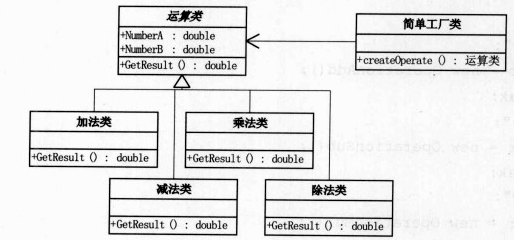

#  一、简单工厂模式

模式特点：工厂根据条件产生不同功能的类
程序实例：四则运算计算器，根据用户的输入产生相应的运算类，用这个运算类处理具体的运算


2. [图片] o_ch1.简单工厂.png   



```
package main
 
import (
    "fmt"
)
 
//BaseOperation接口
type Operation interface {
    getResult() float64
    SetNumA(float64)
    SetNumB(float64)
}
 
type BaseOperation struct {
    numberA float64
    numberB float64
}
 
func (operation *BaseOperation) SetNumA(numA float64) {
    operation.numberA = numA
}
 
func (operation *BaseOperation) SetNumB(numB float64) {
    operation.numberB = numB
}
 
type OperationAdd struct {
    BaseOperation
}
 
func (this *OperationAdd) getResult() float64 {
    return this.numberA + this.numberB
}
 
type OperationSub struct {
    BaseOperation
}
 
func (this *OperationSub) getResult() float64 {
    return this.numberA - this.numberB
}
 
type OperationMul struct {
    BaseOperation
}
 
func (this *OperationMul) getResult() float64 {
    return this.numberA * this.numberB
}
 
type OperationDiv struct {
    BaseOperation
}
 
func (this *OperationDiv) getResult() float64 {
    if this.numberB == 0 {
        panic("被除数不能为0")
    }
    return this.numberA / this.numberB
}
 
type OperationFactory struct {
}
 
func (this *OperationFactory) createOperation(operator string) (operation Operation) {
    switch operator {
    case "+":
        operation = new(OperationAdd)
    case "-":
        operation = new(OperationSub)
    case "/":
        operation = new(OperationDiv)
    case "*":
        operation = new(OperationMul)
    default:
        panic("运算符号错误！")
    }
    return
}
 
func main() {
    defer func() {
        if err := recover(); err != nil {
            fmt.Println(err)
        }
    }()
    var fac OperationFactory
    oper := fac.createOperation("/")
    oper.SetNumA(3.0)
    oper.SetNumB(0.0)
    fmt.Println(oper.getResult())
}


```