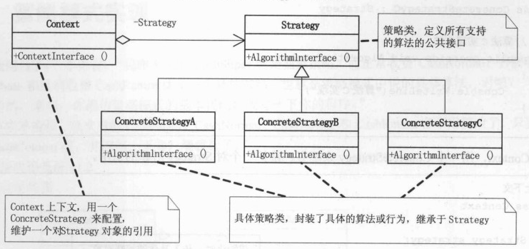

# 二、策略模式


模式特点：定义算法家族并且分别封装，它们之间可以相互替换而不影响客户端。
程序实例：商场收银软件，需要根据不同的销售策略方式进行收费

1. [图片] o_ch2.策略模式.png 

2. [图片] 0_1276989870q5S1.gif    


```
package main
 
import (
    "fmt"
)
 
type cashSuper interface {
    AcceptCash(float64) float64
}
 
type cashNormal struct {
}
 
func (normal *cashNormal) AcceptCash(money float64) float64 {
    return money
}
 
type cashRebate struct {
    moneyRebate float64
}
 
func (rebate *cashRebate) AcceptCash(money float64) float64 {
    return money * rebate.moneyRebate
}
 
type cashReturn struct {
    moneyCondition float64
    moneyReturn    float64
}
 
func (returned *cashReturn) AcceptCash(money float64) float64 {
    if money >= returned.moneyCondition {
        return money - float64(int(money/returned.moneyCondition))*returned.moneyReturn
    } else {
        return money
    }
}
 
type CashContext struct {
    cashSuper
}
 
func NewCashContext(str string) *CashContext {
    cash := new(CashContext)
    switch str {
    case "正常收费":
        cash.cashSuper = &cashNormal{}
    case "满300返100":
        cash.cashSuper = &cashReturn{300, 100}
    case "打8折":
        cash.cashSuper = &cashRebate{0.8}
    }
    return cash
}
 
func main() {
    var total float64
    context := NewCashContext("满300返100")
    total += context.AcceptCash(1 * 10000)
    context = NewCashContext("正常收费")
    total += context.AcceptCash(1 * 10000)
    context = NewCashContext("打8折")
    total += context.AcceptCash(1 * 10000)
    fmt.Println(total)
}
举报


```

