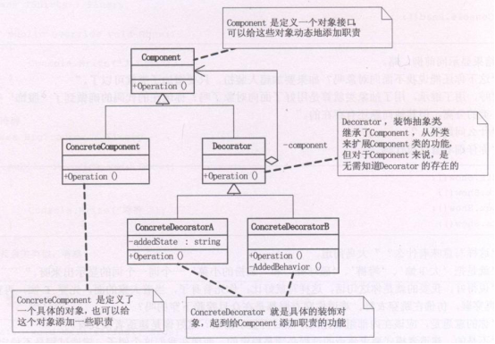
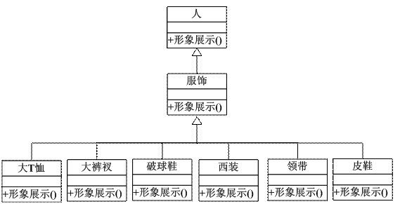

# 三、装饰模式

模式特点：动态地为对象增加额外的职责
程序实例：展示一个人一件一件穿衣服的过程。

 o_ch3.装饰模式.png 
 
 
 0_1277126821AmcS.gif    
  
  
  ```
  package main
 
import (
    "fmt"
)
 
type Person struct {
    Name string
}
 
func (p *Person) show() {
    fmt.Println("装扮的", p.Name)
}
 
type AbstractPerson interface {
    show()
}
 
type Finery struct {
    AbstractPerson
}
 
func (f *Finery) Decorate(component AbstractPerson) {
    f.AbstractPerson = component
}
 
func (f *Finery) show() {
    if f.AbstractPerson != nil {
        f.AbstractPerson.show()
    }
}
 
type TShirts struct {
    Finery
}
 
func (t *TShirts) show() {
    t.Finery.show()
    fmt.Println("大T恤")
}
 
type BigTrouser struct {
    Finery
}
 
func (b *BigTrouser) show() {
    b.Finery.show()
    fmt.Println("大裤衩")
}
 
type Sneakers struct {
    Finery
}
 
func (s *Sneakers) show() {
    s.Finery.show()
    fmt.Println("破球鞋")
}
 
type LeatherShoes struct {
    Finery
}
 
func (l *LeatherShoes) show() {
    l.Finery.show()
    fmt.Println("皮鞋")
}
 
type Suit struct {
    Finery
}
 
func (s *Suit) show() {
    s.Finery.show()
    fmt.Println("西装")
}
 
type Tie struct {
    Finery
}
 
func (t *Tie) show() {
    t.Finery.show()
    fmt.Println("领带")
}
 
func main() {
    person := &(Person{"小菜"})
    fmt.Println("第一种装扮：")
    pqx := new(Sneakers)
    kk := new(BigTrouser)
    dtx := new(TShirts)
    pqx.Decorate(person)
    kk.Decorate(pqx)
    dtx.Decorate(kk)
    dtx.show()
 
    fmt.Println("第二种装扮：")
    px := new(LeatherShoes)
    ld := new(Tie)
    xz := new(Suit)
    px.Decorate(person)
    ld.Decorate(px)
    xz.Decorate(ld)
    xz.show()
 
    fmt.Println("第三种装扮：")
    pqx2 := new(Sneakers)
    px2 := new(LeatherShoes)
    kk2 := new(BigTrouser)
    ld2 := new(Tie)
    pqx2.Decorate(person)
    px2.Decorate(pqx2)
    kk2.Decorate(px2)
    ld2.Decorate(kk2)
    ld2.show()
}
  
  ```

 