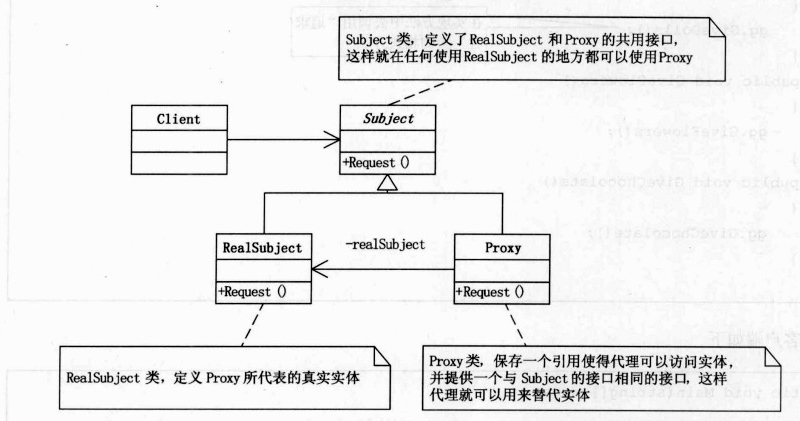
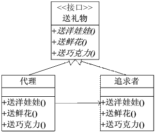

#四、代理模式

模式特点：为其他对象提供一种代理以控制对这个对象的访问。
程序实例：同模式特点描述。

 o_ch.4代理模式.png  
 
 
 

```
package main
 
import (
    "fmt"
)
 
type SchoolGirl struct {
    name string
}
 
func (s *SchoolGirl) setName(name string) {
    s.name = name
}
 
func (s *SchoolGirl) getName() string {
    return s.name
}
 
type Proxy struct {
    gg Pursuit
}
 
func NewProxy(mm SchoolGirl) *Proxy {
    gg := Pursuit{mm}
    return &Proxy{gg}
}
 
func (p *Proxy) giveDolls() {
    p.gg.giveDolls()
}
 
func (p *Proxy) giveFlowers() {
    p.gg.giveFlowers()
}
 
func (p *Proxy) giveChocolate() {
    p.gg.giveChocolate()
}
 
type GiveGift interface {
    giveDolls()
    giveFlowers()
    giveChocolate()
}
 
type Pursuit struct {
    mm SchoolGirl
}
 
func (p *Pursuit) giveDolls() {
    fmt.Println(p.mm.name, "送你洋娃娃")
}
 
func (p *Pursuit) giveFlowers() {
    fmt.Println(p.mm.name, "送你鲜花")
}
 
func (p *Pursuit) giveChocolate() {
    fmt.Println(p.mm.name, "送你巧克力")
}
 
func main() {
    jiaojiao := SchoolGirl{}
    jiaojiao.setName("李娇娇")
 
    daili := NewProxy(jiaojiao)
    daili.giveDolls()
    daili.giveFlowers()
    daili.giveChocolate()
}


```