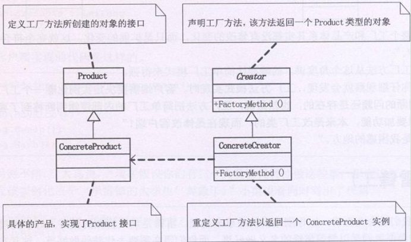
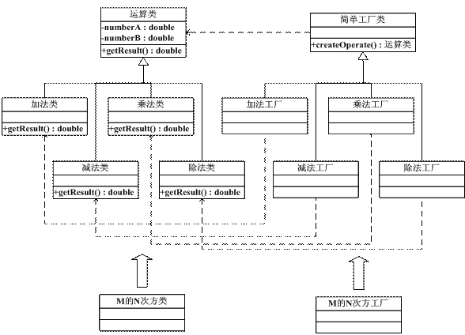

# 五、工厂方法模式（1）

模式特点：定义一个用于创建对象的接口，让子类决定实例化哪一个类。这使得一个类的实例化延迟到其子类。
程序实例：1. 简单工厂改造。





```
package main
 
import (
    "fmt"
)
 
type RealOperation struct {
    numberA float64
    numberB float64
}
 
type OperateAdd struct {
    RealOperation
}
 
type OperateSub struct {
    RealOperation
}
 
type OperateDiv struct {
    RealOperation
}
 
type OperateMul struct {
    RealOperation
}
 
type Operation interface {
    GetResult() float64
    SetNumA(float64)
    SetNumB(float64)
}
 
type Ifactory interface {
    createOperation() Operation
}
 
type AddFactory struct {
}
 
func (a *AddFactory) createOperation() (operation Operation) {
    operation = new(OperateAdd)
    return
}
 
type SubFactory struct {
}
 
func (s *SubFactory) createOperation() (operation Operation) {
    operation = new(OperateSub)
    return
}
 
type DivFactory struct {
}
 
func (d *DivFactory) createOperation() (operation Operation) {
    operation = new(OperateDiv)
    return
}
 
type MulFactory struct {
}
 
func (m *MulFactory) createOperation() (operation Operation) {
    operation = new(OperateMul)
    return
}
 
func (operation *RealOperation) SetNumA(numA float64) {
    operation.numberA = numA
}
 
func (operation *RealOperation) SetNumB(numB float64) {
    operation.numberB = numB
}
 
func (operation *OperateAdd) GetResult() float64 {
    return operation.numberA + operation.numberB
}
 
func (operation *OperateSub) GetResult() float64 {
    return operation.numberA - operation.numberB
}
 
func (operation *OperateMul) GetResult() float64 {
    return operation.numberA * operation.numberB
}
 
func (operation *OperateDiv) GetResult() float64 {
 
    if operation.numberB == 0 {
        panic("被除数不能为0")
    }
    return operation.numberA / operation.numberB
}
 
func main() {
    defer func() {
        if err := recover(); err != nil {
            fmt.Println(err)
        }
    }()
    ifac := new(DivFactory)
    oper := ifac.createOperation()
    oper.SetNumA(1.0)
    oper.SetNumB(3.0)
    fmt.Println(oper.GetResult())
}

```