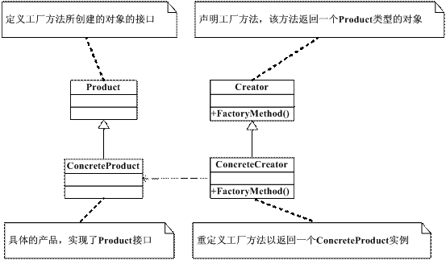

# 工厂方法模式（2）
模式特点：定义一个用于创建对象的接口，让子类决定实例化哪一个类。这使得一个类的实例化延迟到其子类。
程序实例：雷锋类。

 
 
 ```
 package main
 
import (
    "fmt"
)
 
type LeiFeng struct {
}
 
func (l *LeiFeng) sweep() {
    fmt.Println("扫地")
}
 
func (l *LeiFeng) wash() {
    fmt.Println("洗衣")
}
 
func (l *LeiFeng) buyRice() {
    fmt.Println("买米")
}
 
type Undergraduate struct {
    LeiFeng
}
 
type Volunteer struct {
    LeiFeng
}
 
type Ifactory interface {
    createLeiFeng() LeiFeng
}
 
type UndergraduateFactory struct {
}
 
func (u *UndergraduateFactory) createLeiFeng() LeiFeng {
    return new(Undergraduate).LeiFeng
}
 
type VolunteerFactory struct {
}
 
func (v *VolunteerFactory) createLeiFeng() LeiFeng {
    return new(Volunteer).LeiFeng
}
 
func main() {
    ifac := new(UndergraduateFactory)
    student := ifac.createLeiFeng()
    student.wash()
    student.sweep()
    student.buyRice()
 
}

 
 ```
