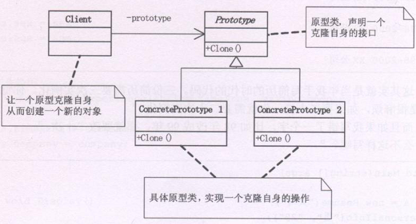
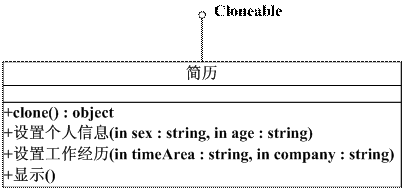

# 原型模式

模式特点：用原型实例指定创建对象的种类，并且通过拷贝这些原型创建新的对象。
程序实例：从简历原型，生成新的简历
代码特点：简历类Resume提供的Clone()方法




```
package main
 
import (
    "fmt"
)
 
type WorkExperience struct {
    timeArea string
    company  string
}
 
func (w *WorkExperience) getWorkDate() string {
    return w.timeArea
}
 
func (w *WorkExperience) setWorkDate(timeArea string) {
    w.timeArea = timeArea
}
 
func (w *WorkExperience) getCompany() string {
    return w.company
}
 
func (w *WorkExperience) setCompany(company string) {
    w.company = company
}
 
type Resume struct {
    name string
    sex  string
    age  string
    WorkExperience
    //timeArea string
    //company  string
}
 
func (r *Resume) setPersonalInfo(name, sex, age string) {
    r.name = name
    r.age = age
    r.sex = sex
}
 
func (r *Resume) setWorkExperience(timeArea, company string) {
    r.company = company
    r.timeArea = timeArea
}
 
func (r *Resume) display() {
    fmt.Println(r.name, r.sex, r.age)
    fmt.Println("工作经历：", r.timeArea, r.company)
}
 
func (r *Resume) clone() *Resume {
    new_obj := (*r)
    return &new_obj
}
 
func main() {
    a := new(Resume)
    a.setPersonalInfo("大鸟", "男", "29")
    a.setWorkExperience("1998-2000", "XX公司")
 
    b := a.clone()
    b.setPersonalInfo("大鸟2", "男", "49")
    b.setWorkExperience("1988-2010", "XXYY公司")
 
    c := a.clone()
    c.setPersonalInfo("大鸟3", "女", "69")
    c.setWorkExperience("1978-2010", "XXYYZZ公司")
 
    a.display()
    b.display()
    c.display()
}


```

