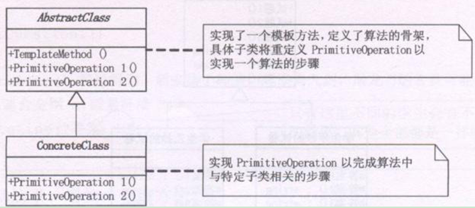
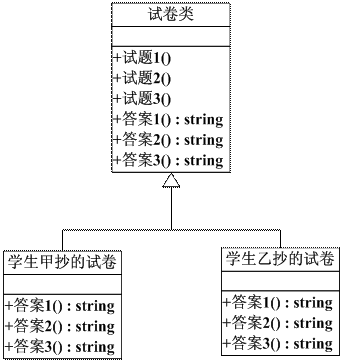

# 七、模板方法模式

模式特点：定义一个操作中的算法骨架，将一些步骤延迟至子类中。
程序实例：考试时使用同一种考卷（父类），不同学生上交自己填写的试卷（子类方法的实现）

 
 

```
package main
 
import (
    "fmt"
    "reflect"
)
 
type TestPaper struct {
    Parent interface{} //虚函数
}
 
func (t *TestPaper) testQuestion1() {
    fmt.Println("杨过得到，后来给了郭靖，练成倚天剑、屠龙刀的玄铁可能是[] a.球磨铸铁 b.马口铁 c.高速合金钥 d.碳素纤维")
    fmt.Println("答案：", t.Answer1())
}
 
func (t *TestPaper) testQuestion2() {
    fmt.Println("杨过、程英、陆无双铲除了情花.造成[] a.使这种植物不再害人 b.使一种珍稀物种灭绝 c.破坏了那个生物圈的生态平衡 d.造成该地区沙漠化")
    fmt.Println("答案：", t.Answer2())
}
 
func (t *TestPaper) testQuestion3() {
    fmt.Println("蓝凤凰致使华山师徒、桃谷六仙呕吐不止，如果你是大夫，会给他们开什么药[] a.阿司匹林 b.牛黄解毒片 c.氟呱酸 d.让他们喝大量的生牛奶 e.以上全不对")
    fmt.Println("答案：", t.Answer3())
}
 
func (t *TestPaper) Answer1() string {
    if t.Parent == nil {
        return ""
    }
    v := reflect.ValueOf(t.Parent)
    res := v.MethodByName("Answer1").Call(nil)
    return res[0].String()
}
 
func (t *TestPaper) Answer2() string {
    if t.Parent == nil {
        return ""
    }
    v := reflect.ValueOf(t.Parent)
    res := v.MethodByName("Answer2").Call(nil)
    return res[0].String()
}
 
func (t *TestPaper) Answer3() string {
    if t.Parent == nil {
        return ""
    }
    v := reflect.ValueOf(t.Parent)
    res := v.MethodByName("Answer3").Call(nil)
    return res[0].String()
}
 
type TestPaperA struct {
    TestPaper
}
 
func (t *TestPaperA) Answer1() string {
    return "b"
}
 
func (t *TestPaperA) Answer2() string {
    return "c"
}
 
func (t *TestPaperA) Answer3() string {
    return "a"
}
 
func NewTestPaperA() *TestPaper {
    paper := new(TestPaper)
    paper.Parent = new(TestPaperA)
    return paper
}
 
func NewTestPaperB() *TestPaper {
    paper := new(TestPaper)
    paper.Parent = new(TestPaperB)
    return paper
}
 
type TestPaperB struct {
    TestPaper
}
 
func (t *TestPaperB) Answer1() string {
    return "c"
}
 
func (t *TestPaperB) Answer2() string {
    return "a"
}
 
func (t *TestPaperB) Answer3() string {
    return "a"
}
 
func main() {
    studentA := NewTestPaperA()
    studentA.testQuestion1()
    studentA.testQuestion2()
    studentA.testQuestion3()
 
    studentB := NewTestPaperB()
    studentB.testQuestion1()
    studentB.testQuestion2()
    studentB.testQuestion3()
}


```

```
package main
 
import (
    "fmt"
)
 
type TestPaper struct {
    Vir interface{} //虚函数
}
 
func (t *TestPaper) testQuestion1() {
    fmt.Println("杨过得到，后来给了郭靖，练成倚天剑、屠龙刀的玄铁可能是[] a.球磨铸铁 b.马口铁 c.高速合金钥 d.碳素纤维")
    fmt.Println("答案：", t.Vir.(VirtTestPaper).answer1())
}
 
func (t *TestPaper) testQuestion2() {
    fmt.Println("杨过、程英、陆无双铲除了情花.造成[] a.使这种植物不再害人 b.使一种珍稀物种灭绝 c.破坏了那个生物圈的生态平衡 d.造成该地区沙漠化")
    fmt.Println("答案：", t.Vir.(VirtTestPaper).answer2())
}
 
func (t *TestPaper) testQuestion3() {
    fmt.Println("蓝凤凰致使华山师徒、桃谷六仙呕吐不止，如果你是大夫，会给他们开什么药[] a.阿司匹林 b.牛黄解毒片 c.氟呱酸 d.让他们喝大量的生牛奶 e.以上全不对")
    fmt.Println("答案：", t.Vir.(VirtTestPaper).answer3())
}
 
/*func (t *TestPaper) answer1() string {
    return ""
}
 
func (t *TestPaper) answer2() string {
    return ""
}
 
func (t *TestPaper) answer3() string {
    return ""
}*/
 
type TestPaperA struct {
    TestPaper
}
 
func (t *TestPaperA) answer1() string {
    return "b"
}
 
func (t *TestPaperA) answer2() string {
    return "c"
}
 
func (t *TestPaperA) answer3() string {
    return "a"
}
 
func NewTestPaperA() *TestPaper {
    paper := new(TestPaper)
    var papera VirtTestPaper = new(TestPaperA)
    paper.Vir = papera
    return paper
}
 
func NewTestPaperB() *TestPaper {
    paper := new(TestPaper)
    var papera VirtTestPaper = new(TestPaperB)
    paper.Vir = papera
    return paper
}
 
type VirtTestPaper interface {
    answer1() string
    answer2() string
    answer3() string
}
 
type TestPaperB struct {
    TestPaper
}
 
func (t *TestPaperB) answer1() string {
    return "c"
}
 
func (t *TestPaperB) answer2() string {
    return "a"
}
 
func (t *TestPaperB) answer3() string {
    return "a"
}
 
func main() {
    studentA := NewTestPaperA()
    studentA.testQuestion1()
    studentA.testQuestion2()
    studentA.testQuestion3()
 
    studentB := NewTestPaperB()
    studentB.testQuestion1()
    studentB.testQuestion2()
    studentB.testQuestion3()
}

```