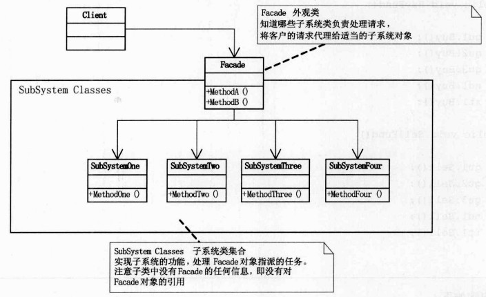
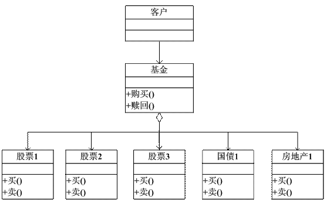

# 外观模式

模式特点：为一组调用提供一致的接口。
程序实例：接口将几种调用分别组合成为两组，用户通过接口调用其中的一组。

 
 

```
package main
 
import (
    "fmt"
)
 
type Stock1 struct {
}
 
func (s *Stock1) sell() {
    fmt.Println("股票1卖出")
}
 
func (s *Stock1) buy() {
    fmt.Println("股票1买进")
}
 
type Stock2 struct {
}
 
func (s *Stock2) sell() {
    fmt.Println("股票2卖出")
}
 
func (s *Stock2) buy() {
    fmt.Println("股票2买进")
}
 
type Stock3 struct {
}
 
func (s *Stock3) sell() {
    fmt.Println("股票3卖出")
}
 
func (s *Stock3) buy() {
    fmt.Println("股票3买进")
}
 
type NationalDebt1 struct {
}
 
func (n *NationalDebt1) sell() {
    fmt.Println("国债1卖出")
}
 
func (n *NationalDebt1) buy() {
    fmt.Println("国债1买进")
}
 
type Realty1 struct {
}
 
func (r *Realty1) sell() {
    fmt.Println("房地产1卖出")
}
 
func (r *Realty1) buy() {
    fmt.Println("房地产1买进")
}
 
type Fund struct {
    gu1 Stock1
    gu2 Stock2
    gu3 Stock3
    nd1 NationalDebt1
    rt1 Realty1
}
 
func (f *Fund) buyFund() {
    f.gu1.buy()
    f.gu2.buy()
    f.gu3.buy()
    f.rt1.buy()
    f.nd1.buy()
}
 
func (f *Fund) sellFund() {
    f.gu1.sell()
    f.gu2.sell()
    f.gu3.sell()
    f.rt1.sell()
    f.nd1.sell()
}
 
func NewFund() *Fund {
    return &Fund{Stock1{}, Stock2{}, Stock3{}, NationalDebt1{}, Realty1{}}
}
 
func main() {
    jijin := NewFund()
    jijin.buyFund()
    jijin.sellFund()
}

```