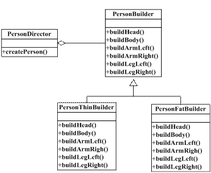
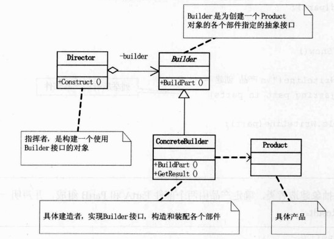

# 九、建造者模式

模式特点：将一个复杂对象的构建(Director)与它的表示(Builder)分离，使得同样的构建过程可以创建不同的表示(ConcreteBuilder)。
程序实例：“画”出一个四肢健全（头身手腿）的小人

 
 

```
package main
 
import (
    "fmt"
    "reflect"
    //"unsafe"
)
 
type PersonBuilder interface {
    buildHead()
    buildBody()
    buildArmRight()
    buildArmLeft()
    buildLegRight()
    buildLegLeft()
    display_personBuilding() *PersonBuilding
}
 
type PersonBuilding struct {
    head, body, leftarm, rightarm, leftleg, rightleg string
}
 
type PersonThinBuilder struct {
    building *PersonBuilding
}
 
func (this *PersonThinBuilder) buildBody() {
    this.building.body = "draw thin body..."
}
 
func (this *PersonThinBuilder) buildHead() {
    this.building.head = "draw thin head..."
}
 
func (this *PersonThinBuilder) buildArmRight() {
    this.building.rightarm = "draw thin arm right..."
}
 
func (this *PersonThinBuilder) buildArmLeft() {
    this.building.leftarm = "draw thin arm left..."
}
 
func (this *PersonThinBuilder) buildLegRight() {
    this.building.rightleg = "draw thin leg right..."
}
 
func (this *PersonThinBuilder) buildLegLeft() {
    this.building.leftleg = "draw thin leg left..."
}
 
func (p *PersonThinBuilder) display_personBuilding() *PersonBuilding {
    return p.building
}
 
func NewPersonThinBuilder() *PersonThinBuilder {
    return &PersonThinBuilder{new(PersonBuilding)}
}
 
type PersonFatBuilder struct {
    building *PersonBuilding
}
 
func (this *PersonFatBuilder) buildBody() {
    this.building.body = "draw fat body..."
}
 
func (this *PersonFatBuilder) buildHead() {
    this.building.head = "draw fat head..."
}
 
func (this *PersonFatBuilder) buildArmRight() {
    this.building.rightarm = "draw fat arm right..."
}
 
func (this *PersonFatBuilder) buildArmLeft() {
    this.building.leftarm = "draw fat arm left..."
}
 
func (this *PersonFatBuilder) buildLegRight() {
    this.building.rightleg = "draw fat leg right..."
}
 
func (this *PersonFatBuilder) buildLegLeft() {
    this.building.leftleg = "draw fat leg left..."
}
 
func (p *PersonFatBuilder) display_personBuilding() *PersonBuilding {
    return p.building
}
 
func NewPersonFatBuilder() *PersonFatBuilder {
    return &PersonFatBuilder{new(PersonBuilding)}
}
 
type PersonDirector struct {
    PersonBuilder
}
 
func (p *PersonDirector) createPerson() {
    p.buildHead()
    p.buildBody()
    p.buildArmLeft()
    p.buildArmRight()
    p.buildLegLeft()
    p.buildLegRight()
}
 
func (p *PersonDirector) display_personBuilding() *PersonBuilding {
    return p.PersonBuilder.display_personBuilding()
}
 
func main() {
 
    ptb := NewPersonThinBuilder()
    pdThin := &PersonDirector{ptb}
    pdThin.createPerson()
    building := pdThin.display_personBuilding()
    value := reflect.ValueOf(*building)
    for i := 0; i < value.NumField(); i++ {
        fmt.Println(value.Field(i))
    }
    //x := unsafe.Pointer(building)
    //fmt.Println(*(*string)(unsafe.Pointer(uintptr(x))))
    //fmt.Println(*(*string)(unsafe.Pointer(uintptr(x) + unsafe.Offsetof(building.body))))
    //fmt.Println(*(*string)(unsafe.Pointer(uintptr(x) + unsafe.Offsetof(building.leftarm))))
    //fmt.Println(*(*string)(unsafe.Pointer(uintptr(x) + unsafe.Offsetof(building.rightarm))))
    //fmt.Println(*(*string)(unsafe.Pointer(uintptr(x) + unsafe.Offsetof(building.leftleg))))
    //fmt.Println(*(*string)(unsafe.Pointer(uintptr(x) + unsafe.Offsetof(building.righleg))))
    //fmt.Println(building)
}

```

